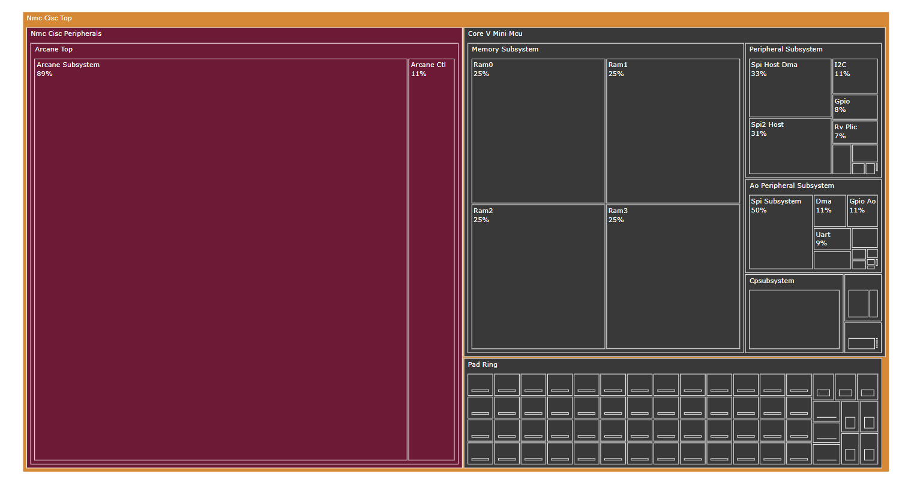

# area-plot-post-syn
This repository contains a python script allowing to plot in `treemap` format and analyze the post-synthesis area report of your RTL design.
By providing an interactive interface through [`plotly`](https://plotly.com) library, the tool enables hierarchical designs exploration.
Furthermore, it represents a simple way to visualize complex designs, observing the relative dimensions of the different components and their impact on the overall design.



## Usage as a standalone script

### Install requirements

All packages to run the tool are grouped in the `requirements.txt` and `environment.yml` file.

- __Pip__: you can install the required dependencies into an existing Python environment using Pip:
    ```bash
    python3 -m pip install -r requirements.txt
    ```

- __Conda__: you can create a new [`conda`](https://docs.anaconda.com/) environment with:
    ```bash
    conda env create -f environment.yml
    ```

Alternatively, you can use the equivalent `make` targets:
```bash
make pip # install dependencies using pip
make conda # create a new conda environment with the dependencies
```

### Generate the area chart

To plot the layout of a design, the only requirement is a post-synthesis area report.
Launch the area generation thorugh the command:
```bash
python3 area_plot.py --filename report_file.rpt
```
Further options are available to tweak the interactive plot, such as plotting only modules whose area contribution is higher than a certain percentage or setting the maximum hierarchical level up to which visualize the block scheme.


For all available options try:
```bash
python3 area_plot.py --help
```
The tool also supports interactive `sunburst` visualization using [plotly](https://plotly.com/python/sunburst-charts/)

The tool has only been tested using Synopsys DC® output files

## Install as Python module

The tool can also be installed as `area-plot`, provided that its dependencies are compatible with the existing environment. This can be achieved with:
```bash
make install
```
Once installed, the tool can be used as the standalone script, e.g.:
```bash
area-plot --help
``` 
